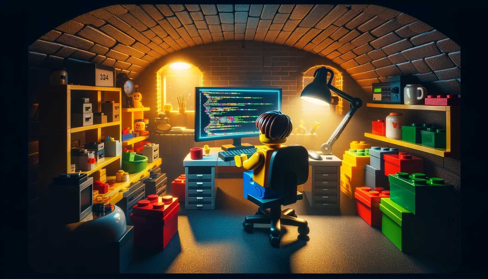

 &nbsp;

- 👨‍💼 I'm currently working at [Exlabs](https://exlabs.com/) as project Technical Leader

## 💡 A Quote:

[%20given%20to%20an%20end-user%20remains%20untested%20hypothesis&type=horizontal&theme=dark&author=Ewald%20Verhoeven%20@%20DevConf2023)](https://github.com/piyushsuthar/github-readme-quotes)

## 💻 My Current Tech Stack:

## 📚 Tech Stack I'm learning:

[)](https://skills.syvixor.com)

## 🪦 Tech Stack I used before:

## 📖 Read My Articles:

- [AI projects takeaways](https://www.linkedin.com/pulse/ai-project-takeaways-exlabs-lxc4f/)
- [Writing cleaner Jest tests](https://exlabs.com/insights/writing-cleaner-jest-tests/)
- [Left join for advanced rubyists](https://exlabs.com/insights/left-join-for-advanced-rubyists/)

## 🏆 My Stats:

    

## 🎮 When I'm AFK:
- Lego 🧱
- Star Wars ⭐
- Magic the Gathering 🎴 ✨
- Sushi 🍣 🍙 🍤
